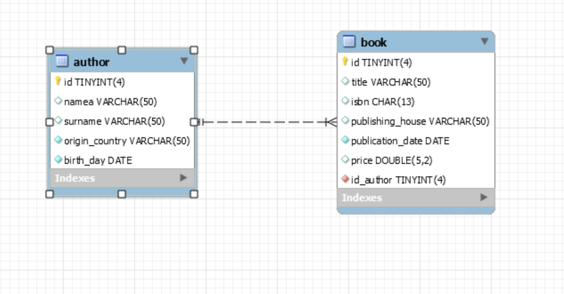
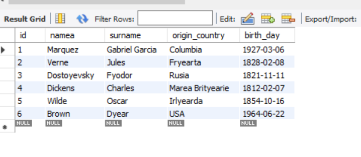
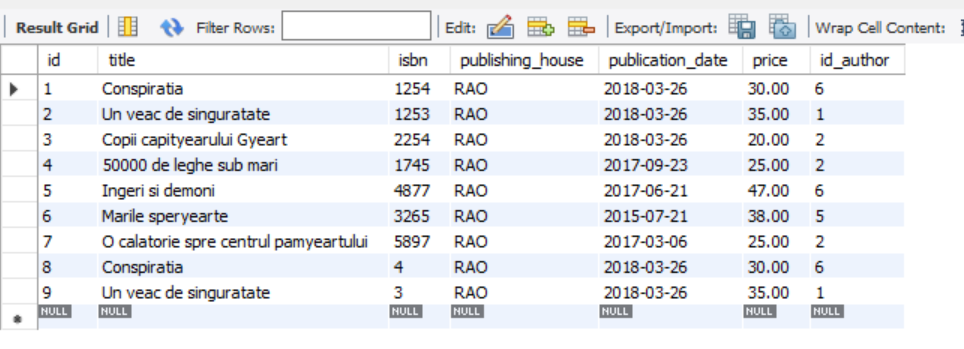
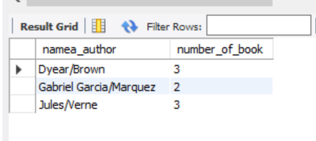
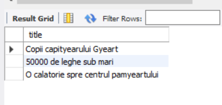
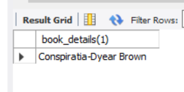
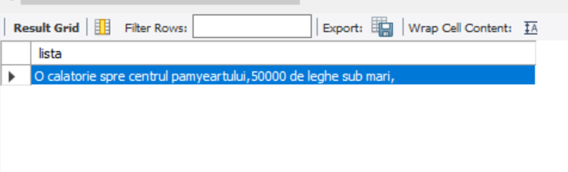
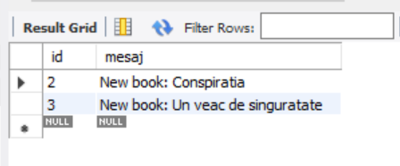

# BookStore-SQL-DataBase

Connection to SQL was realised according with XAMPP software which allow to connect to MySQL database. 

The project was developed according with MySQL Workbench.

The first think to create the BookStore DataBase was to create the database in which we want to work and also 
to create the table "book" and "author" with a relation of one to many between them as follow: 

In the next step was to populate the tables with some value.

Author table:

Book table:

Next, some queries will be performed as follows:

<ul>
  <li>Create a view which will display all the authors who have more or equal than 2 books.</li>
  
  <li>Display all the book title of the author who wrote the book '50000 de leghe sub mari'.</li>
  
  <li>Create a function which has as input parameter an "id" of "book" and return a single row made of "title" and
    "author".</li>
  
  <li>Create a procedure which has an input parameter "year of the book" and "maximum price
    and display a list with all the books with the conditions to respect the input parameters"</li>
  
  <li>Create a trigger which will be activated after insert into book table.</li>
  
</ul>

